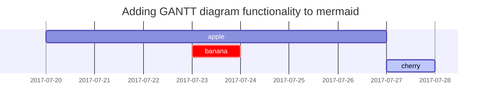

# 🌟 Features

## 🌈 Headings

# H1 - heading

## H2 - heading

### H3 - heading

#### H4 - heading

##### H5 - heading

###### H6 - heading

## 📝 Paragraph

Quisque egestas convallis ipsum, ut sollicitudin risus tincidunt a. Maecenas interdum malesuada egestas. Duis consectetur porta risus, sit amet vulputate urna facilisis ac. Phasellus semper dui non purus ultrices sodales. Aliquam ante lorem, ornare a feugiat ac, finibus nec mauris. Vivamus ut tristique nisi. Sed vel leo vulputate, efficitur risus non, posuere mi. Nullam tincidunt bibendum rutrum. Proin commodo ornare sapien. Vivamus interdum diam sed sapien blandit, sit amet aliquam risus mattis. Nullam arcu turpis, mollis quis laoreet at, placerat id nibh. Suspendisse venenatis eros eros.

## 📋 Lists

### Ordered list

1. Firstly
2. Secondly
3. Thirdly

### Unordered list

- Chapter
  - Section
    - Paragraph

### ToDo list

- [ ] Job
  - [x] Step 1
  - [x] Step 2
  - [ ] Step 3

### Description list

Sun
: the star around which the earth orbits

Moon
: the natural satellite of the earth, visible by reflected light from the sun

## 📌 Block Quote

> This line shows the _block quote_.
>
> -- **author**

### 📝 Note

> [!NOTE]
> Essential details that users should not overlook, even when browsing quickly.

### 💡 Tip

> [!TIP]
> Additional advice to aid users in achieving better outcomes.

### 🔑 Important

> [!IMPORTANT]
> Vital information required for users to attain success.

### ⚠️ Warning

> [!WARNING]
> Urgent content that requires immediate user focus due to possible risks.

### 🚨 Caution

> [!CAUTION]
> Possible negative outcomes resulting from an action.

## 📊 Tables

| Company                      | Contact          | Country |
| :--------------------------- | :--------------- | ------: |
| Alfreds Futterkiste          | Maria Anders     | Germany |
| Island Trading               | Helen Bennett    |      UK |
| Magazzini Alimentari Riuniti | Giovanni Rovelli |   Italy |

## 🔗 Links

<http://127.0.0.1:4000>

## 📄 Footnote

Click the hook will locate the footnote[^footnote], and here is another footnote[^fn-nth-2].

## 💻 Inline code

This is an example of `Inline Code`.

## 📁 Filepath

Here is the `/path/to/the/file.extend`

## 💻 Code blocks

### Common

```text
This is a common code snippet, without syntax highlight and line number.
```

### Specific Language

```bash
if [ $? -ne 0 ]; then
  echo "The command was not successful.";
  #do the needful / exit
fi;
```

### Specific filename

```sass
@import
  "colors/light-typography",
  "colors/dark-typography";
```

## ➗ Mathematics

The mathematics powered by [**MathJax**](https://www.mathjax.org/):

$$
\begin{equation}
  \sum_{n=1}^\infty 1/n^2 = \frac{\pi^2}{6}
  \label{eq:series}
\end{equation}
$$

We can reference the equation as \eqref{eq:series}.

When $a \ne 0$, there are two solutions to $ax^2 + bx + c = 0$ and they are

$$ x = {-b \pm \sqrt{b^2-4ac} \over 2a} $$

## 🌊 Mermaid SVG



## 🔄 Reverse Footnote

[^footnote]: The footnote source
[^fn-nth-2]: The 2nd footnote source
